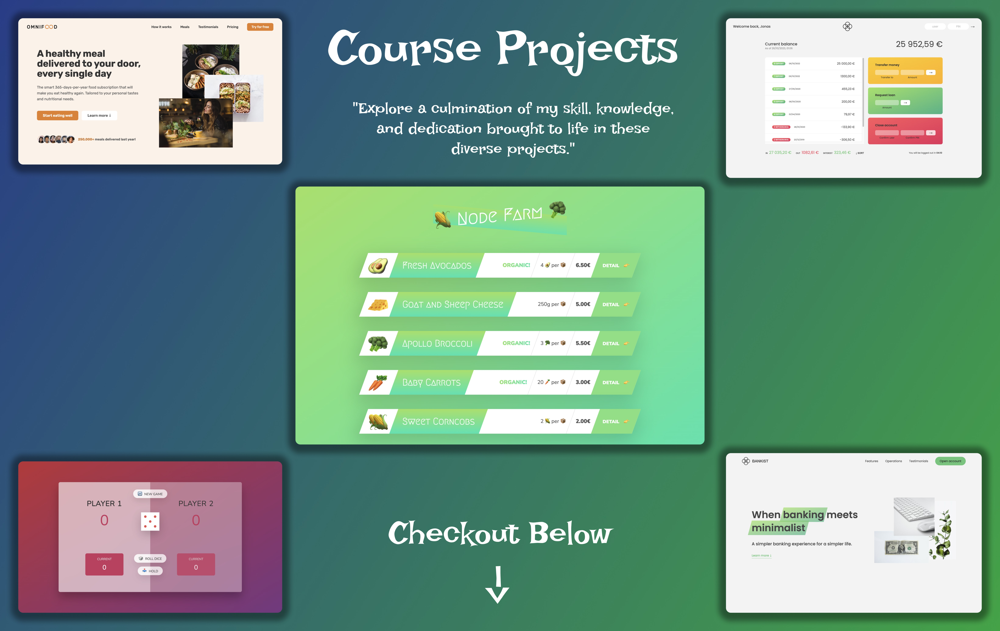

<h1 align="center">📚 My Course Learning Projects 📝 </h1>

I am proud to share with you a comprehensive list of all the courses I have taken to learn new skills and technologies. For each course, I have included a detailed list of the projects I completed, along with their corresponding source code and live project URLs. Additionally, I have also provided certificates of completion for each course. I am excited to showcase my hard work and dedication to personal and professional growth.

 

  
  

Click [here](https://rajeev-course-projects.netlify.app/) to checkout my course projects.

## Listing of projects

 
  
<h2>📝 HTML CSS </h2>

Checkout certificate [here](https://www.udemy.com/certificate/UC-25115396-b252-44fb-a4be-065986030158/)

| Name of the Project |                   Live Project View                   | Source Code                                                     |
| :------------------ | :---------------------------------------------------: | :-------------------------------------------------------------- |
| 1. Omnifood         | [Project Demo](https://omnifood-rajeev.netlify.app/)  | [Project Code](https://github.com/beRajeevKumar/Omnifood.git)   |
| 2. Table Shop       | [Project Demo](https://chairshop-rajeev.netlify.app/) | [Project Code](https://github.com/beRajeevKumar/Table-Shop.git) |
| 3. Blog Page        | [Project Demo](https://blog-post-rajeev.netlify.app/) | [Project Code](https://github.com/beRajeevKumar/Blog-Post.git)  |

 
  
<h2>📝 Advance CSS & SASS </h2>

Checkout certificate [here](https://www.udemy.com/certificate/UC-25115396-b252-44fb-a4be-065986030158/)

| Name of the Project |              Live Project View               | Source Code                                                           |
| :------------------ | :------------------------------------------: | :-------------------------------------------------------------------- |
| 1. Natorus          | [Project Demo](https://natours.netlify.app/) | [Project Code](https://github.com/beRajeevKumar/Natours-Frontend.git) |

 
  
<h2>🛠️ JavaScript Development</h2>

Checkout certificate [here](https://www.udemy.com/certificate/UC-ac38e21b-6b76-4404-8ebe-2956c1eb185f/)

| Name of the Project   |                       Live Project View                        | Source Code                                                            |
| :-------------------- | :------------------------------------------------------------: | :--------------------------------------------------------------------- |
| 1. Bankist            |      [Project Demo](https://bankist-rajeev.netlify.app/)       | [Project Code](https://github.com/beRajeevKumar/Bankist.git)           |
| 2. Bankist Calculator | [Project Demo](https://rajeev-bankist-calculator.netlify.app/) | [Project Code](https://github.com/beRajeevKumar/BankistCalculator.git) |
| 3. Dice Game          |     [Project Demo](https://rajeev-dice-game.netlify.app/)      | [Project Code](https://github.com/beRajeevKumar/Dice-Game.git)         |
| 4. Guess Game         |   [Project Demo](https://guessmynumber-rajeev.netlify.app/)    | [Project Code](https://github.com/beRajeevKumar/Guess-My-Number.git)   |
| 5. Modal Window       |    [Project Demo](https://rajeev-modalwindow.netlify.app/)     | [Project Code](https://github.com/beRajeevKumar/Modal-Window.git)      |

 
  
<h2>🛠️ React Development</h2>

Checkout certificate [here](https://www.udemy.com/certificate/UC-ac38e21b-6b76-4404-8ebe-2956c1eb185f/)

| Name of the Project |                   Live Project View                    | Source Code                                                      |
| :------------------ | :----------------------------------------------------: | :--------------------------------------------------------------- |
| 1. React Features   | [Project Demo](https://reactfacts-rajeev.netlify.app/) | [Project Code](https://github.com/beRajeevKumar/React-Facts.git) |

 
  
<h2>🛠️ Backend Development </h2>

Checkout certificate [here](https://www.udemy.com/certificate/UC-ac38e21b-6b76-4404-8ebe-2956c1eb185f/)

| Name of the Project |                   Live Project View                   | Source Code                                                    |
| :------------------ | :---------------------------------------------------: | :------------------------------------------------------------- |
| 1. Node Farm        | [Project Demo](https://rajeev-nodefarm.onrender.com/) | [Project Code](https://github.com/beRajeevKumar/Node-Farm.git) |

 
  
<h2>🛠️ Python Development </h2>

Checkout certificate [here](https://www.udemy.com/certificate/UC-ac38e21b-6b76-4404-8ebe-2956c1eb185f/)

| Name of the Project |                   Live Project View                   | Source Code                                                    |
| :------------------ | :---------------------------------------------------: | :------------------------------------------------------------- |
| 1. Node Farm        | [Project Demo](https://rajeev-nodefarm.onrender.com/) | [Project Code](https://github.com/beRajeevKumar/Node-Farm.git) |

## Useful Links

- [Project Demo](https://rajeev-course-projects.netlify.app/) - Live Project URL

- [Project Repository](https://github.com/beRajeevKumar/Course-Projects.git)

## Need help?

Feel free to contact me on [Twitter](https://twitter.com/be_rajeevkumar) or [LinkedIn](https://www.linkedin.com/in/berajeevkumar/), know more about me at [Portfolio](https://iamrajeev.me).

<h1 align=center>Happy Coding 👨‍💻</h1>
