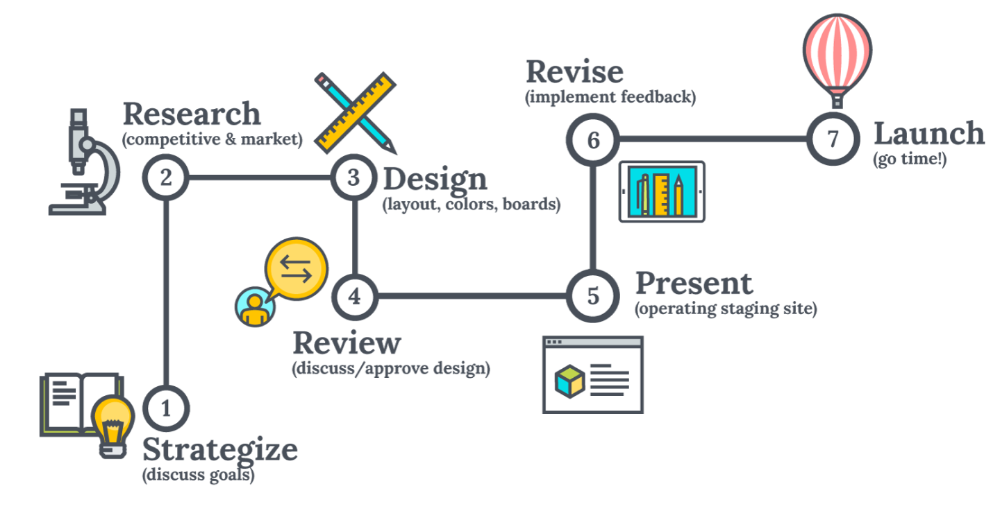

<h1 align="center">My Course Learning Projects 📝 </h1>

I am proud to share with you a comprehensive list of all the courses I have taken to learn new skills and technologies. For each course, I have included a detailed list of the projects I completed, along with their corresponding source code and live project URLs. Additionally, I have also provided certificates of completion for each course. I am excited to showcase my hard work and dedication to personal and professional growth.
 

  
  

Click [here](https://rajeev-course-projects.netlify.app/) to checkout my course projects.

## Listing of projects

 
  
<h2>📝 HTML CSS </h2>

Checkout certificate [here](https://www.udemy.com/certificate/UC-25115396-b252-44fb-a4be-065986030158/)

| Name of the Project |                   Live Project View                   | Source Code                                                        |
| :------------------ | :---------------------------------------------------: | :----------------------------------------------------------------- |
| 1. Omnifood         | [Project Demo](https://omnifood-rajeev.netlify.app/)  | [Project Code](https://github.com/Rajeevjewar/OmnifoodProject.git) |
| 2. Table Shop       | [Project Demo](https://rajeevchairshop.netlify.app/)  | [Project Code](https://github.com/Rajeevjewar/Table-Shop.git)      |
| 3. Blog Page        | [Project Demo](https://blog-post-rajeev.netlify.app/) | [Project Code](https://github.com/Rajeevjewar/Blog-Post.git)       |

 
  
<h2>📝 Advance CSS & SASS </h2>

Checkout certificate [here](https://www.udemy.com/certificate/UC-25115396-b252-44fb-a4be-065986030158/)

| Name of the Project |                   Live Project View                   | Source Code                                                        |
| :------------------ | :---------------------------------------------------: | :----------------------------------------------------------------- |
| 1. Omnifood         | [Project Demo](https://omnifood-rajeev.netlify.app/)  | [Project Code](https://github.com/Rajeevjewar/OmnifoodProject.git) |
| 2. Table Shop       | [Project Demo](https://rajeevchairshop.netlify.app/)  | [Project Code](https://github.com/Rajeevjewar/Table-Shop.git)      |
| 3. Blog Page        | [Project Demo](https://blog-post-rajeev.netlify.app/) | [Project Code](https://github.com/Rajeevjewar/Blog-Post.git)       |

 
  
<h2>🛠️ JavaScript Development</h2>

| Name of the Project  |                                     Live Project View                                      | Source Code                                                                                            |
| :------------------- | :----------------------------------------------------------------------------------------: | :----------------------------------------------------------------------------------------------------- |
| 1. Community Card    |       [Project Demo](https://frontend-mentor-rajeev.netlify.app/01-community-card/)        | [Project Code](https://github.com/Rajeevjewar/Frontend-Mentor-Projects/tree/main/01-Community-Card)    |
| 2. Qr Code Component | [Project Demo](https://frontend-mentor-rajeev.netlify.app/02-qr-code-component/index.html) | [Project Code](https://github.com/Rajeevjewar/Frontend-Mentor-Projects/tree/main/02-qr-code-component) |
| 3. Social Proof      |   [Project Demo](https://frontend-mentor-rajeev.netlify.app/03-social-proof/index.html)    | [Project Code](https://github.com/Rajeevjewar/Frontend-Mentor-Projects/tree/main/03-social-proof)      |
| 4. Nft Project       |    [Project Demo](https://frontend-mentor-rajeev.netlify.app/04-nft-project/index.html)    | [Project Code](https://github.com/Rajeevjewar/Frontend-Mentor-Projects/tree/main/04-nft-project)       |
| 5. Intractive Rating | [Project Demo](https://frontend-mentor-rajeev.netlify.app/05-intractive-rating/index.html) | [Project Code](https://github.com/Rajeevjewar/Frontend-Mentor-Projects/tree/main/05-intractive-rating) |

 
  
<h2>🛠️ React Development</h2>

| Name of the Project  |                                     Live Project View                                      | Source Code                                                                                            |
| :------------------- | :----------------------------------------------------------------------------------------: | :----------------------------------------------------------------------------------------------------- |
| 1. Community Card    |       [Project Demo](https://frontend-mentor-rajeev.netlify.app/01-community-card/)        | [Project Code](https://github.com/Rajeevjewar/Frontend-Mentor-Projects/tree/main/01-Community-Card)    |
| 2. Qr Code Component | [Project Demo](https://frontend-mentor-rajeev.netlify.app/02-qr-code-component/index.html) | [Project Code](https://github.com/Rajeevjewar/Frontend-Mentor-Projects/tree/main/02-qr-code-component) |
| 3. Social Proof      |   [Project Demo](https://frontend-mentor-rajeev.netlify.app/03-social-proof/index.html)    | [Project Code](https://github.com/Rajeevjewar/Frontend-Mentor-Projects/tree/main/03-social-proof)      |
| 4. Nft Project       |    [Project Demo](https://frontend-mentor-rajeev.netlify.app/04-nft-project/index.html)    | [Project Code](https://github.com/Rajeevjewar/Frontend-Mentor-Projects/tree/main/04-nft-project)       |
| 5. Intractive Rating | [Project Demo](https://frontend-mentor-rajeev.netlify.app/05-intractive-rating/index.html) | [Project Code](https://github.com/Rajeevjewar/Frontend-Mentor-Projects/tree/main/05-intractive-rating) |

 
  
<h2>🛠️ Backend Development </h2>

| Name of the Project  |                                     Live Project View                                      | Source Code                                                                                            |
| :------------------- | :----------------------------------------------------------------------------------------: | :----------------------------------------------------------------------------------------------------- |
| 1. Community Card    |       [Project Demo](https://frontend-mentor-rajeev.netlify.app/01-community-card/)        | [Project Code](https://github.com/Rajeevjewar/Frontend-Mentor-Projects/tree/main/01-Community-Card)    |
| 2. Qr Code Component | [Project Demo](https://frontend-mentor-rajeev.netlify.app/02-qr-code-component/index.html) | [Project Code](https://github.com/Rajeevjewar/Frontend-Mentor-Projects/tree/main/02-qr-code-component) |
| 3. Social Proof      |   [Project Demo](https://frontend-mentor-rajeev.netlify.app/03-social-proof/index.html)    | [Project Code](https://github.com/Rajeevjewar/Frontend-Mentor-Projects/tree/main/03-social-proof)      |
| 4. Nft Project       |    [Project Demo](https://frontend-mentor-rajeev.netlify.app/04-nft-project/index.html)    | [Project Code](https://github.com/Rajeevjewar/Frontend-Mentor-Projects/tree/main/04-nft-project)       |
| 5. Intractive Rating | [Project Demo](https://frontend-mentor-rajeev.netlify.app/05-intractive-rating/index.html) | [Project Code](https://github.com/Rajeevjewar/Frontend-Mentor-Projects/tree/main/05-intractive-rating) |

 
  
<h2>🛠️ Python Development </h2>

| Name of the Project  |                                     Live Project View                                      | Source Code                                                                                            |
| :------------------- | :----------------------------------------------------------------------------------------: | :----------------------------------------------------------------------------------------------------- |
| 1. Community Card    |       [Project Demo](https://frontend-mentor-rajeev.netlify.app/01-community-card/)        | [Project Code](https://github.com/Rajeevjewar/Frontend-Mentor-Projects/tree/main/01-Community-Card)    |
| 2. Qr Code Component | [Project Demo](https://frontend-mentor-rajeev.netlify.app/02-qr-code-component/index.html) | [Project Code](https://github.com/Rajeevjewar/Frontend-Mentor-Projects/tree/main/02-qr-code-component) |
| 3. Social Proof      |   [Project Demo](https://frontend-mentor-rajeev.netlify.app/03-social-proof/index.html)    | [Project Code](https://github.com/Rajeevjewar/Frontend-Mentor-Projects/tree/main/03-social-proof)      |
| 4. Nft Project       |    [Project Demo](https://frontend-mentor-rajeev.netlify.app/04-nft-project/index.html)    | [Project Code](https://github.com/Rajeevjewar/Frontend-Mentor-Projects/tree/main/04-nft-project)       |
| 5. Intractive Rating | [Project Demo](https://frontend-mentor-rajeev.netlify.app/05-intractive-rating/index.html) | [Project Code](https://github.com/Rajeevjewar/Frontend-Mentor-Projects/tree/main/05-intractive-rating) |

## Useful Links

- [Project Demo](https://rajeev-course-projects.netlify.app/) - Live Project URL

- [Project Repository](https://github.com/Rajeevjewar/Course-Projects.git)

## Need help?

Feel free to contact me on [Twitter](https://twitter.com/be_rajeevkumar) or [LinkedIn](https://www.linkedin.com/in/berajeevkumar/), know more about me at [iamrajeev.me](https://iamrajeev.me)

<h1 align=center>Happy Coding 👨‍💻</h1>

Show some ❤️&nbsp; by giving the star to this repo

